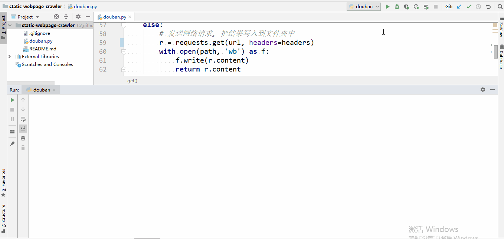
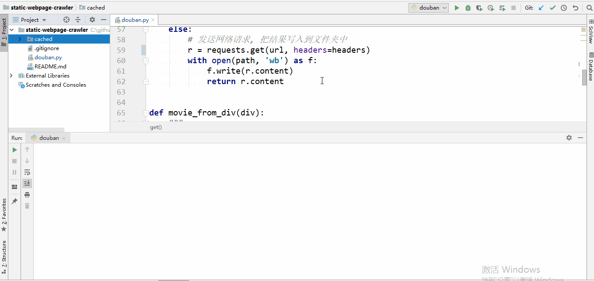

豆瓣电影TOP250爬虫
================================
## 简介
* 基于Python的requests库和pyquery库，爬取豆瓣电影TOP250内容
* 加入缓存功能，将页面内容缓存至本地，实现下载页面和爬取页面的解耦，提高爬虫效率的同时，避免了需求内容更改，爬取过程中断等需要重复请求网络的耗时
* 利用css选择器在拿到的页面数据中筛选目标内容

## 依赖
* Windows 10

* Python 3.6

## 详细演示
### 无缓存进行爬虫

### 带缓存进行爬虫

